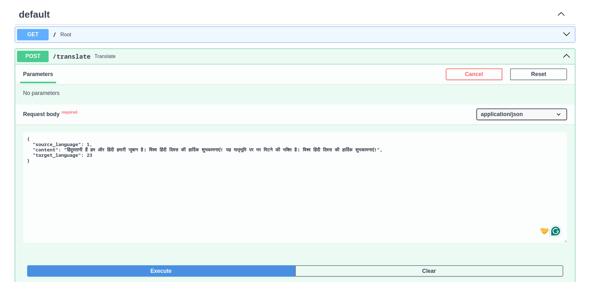
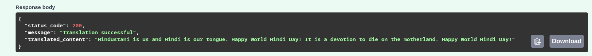

# Custom Language Translation API


## Getting Started
To run this API locally, follow the steps below:

1. Clone the repository:

   ```
   git clone https://github.com/garvit420/Bhashini_custom_api.git
   ```

2. install fastapi and uvicorn:

   ```
   pip install fastapi uvicorn
   ```
   
3. Start the API using Uvicorn:

   ```
   python -m uvicorn main:app --reload
   ```

The API will be available at `http://localhost:8000`. You can access the documentation at `http://localhost:8000/docs`.

## Usage
- **Endpoint**: `/translate`
- **Method**: POST

**Request Format**
```json
{
  "source_language": <Integer>,
  "content": <String>,
  "target_language": <Integer>
}
```

**Response Format**
```json
{
  "status_code": <Integer>,
  "message": <String>,
  "translated_content": <String>
}
```

## Supported Languages
You can specify languages using their respective numbers in the request.

1. Hindi
2. Gom
3. Kannada
4. Dogri
5. Bodo
6. Urdu
7. Tamil
8. Kashmiri
9. Assamese
10. Bengali
11. Marathi
12. Sindhi
13. Maithili
14. Punjabi
15. Malayalam
16. Manipuri
17. Telugu
18. Sanskrit
19. Nepali
20. Santali
21. Gujarati
22. Odia
23. English
